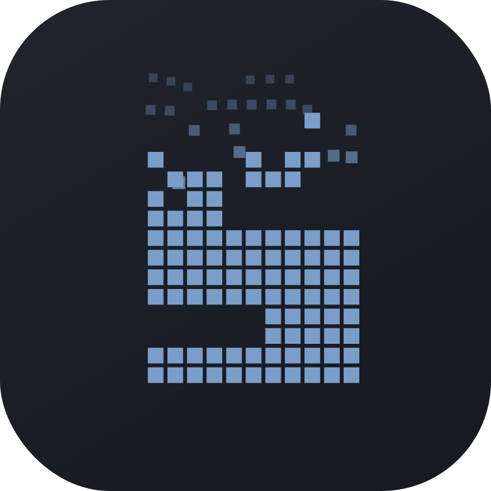
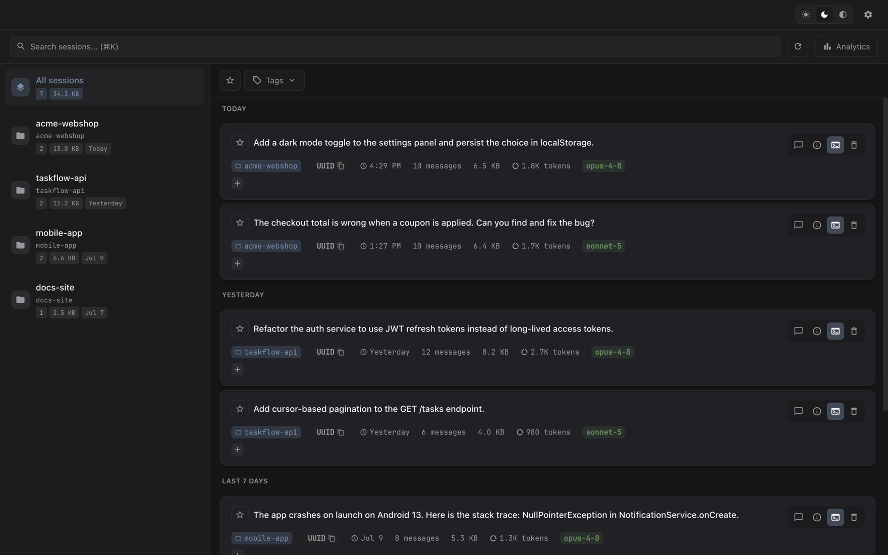
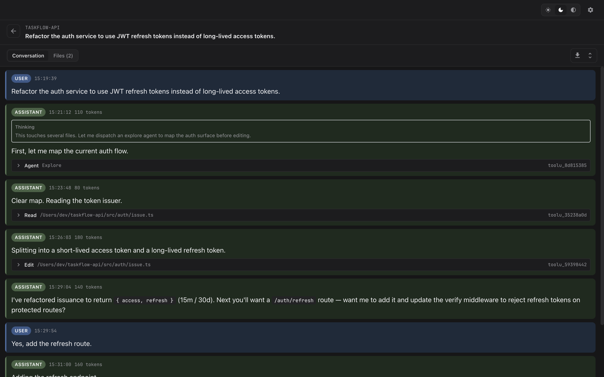
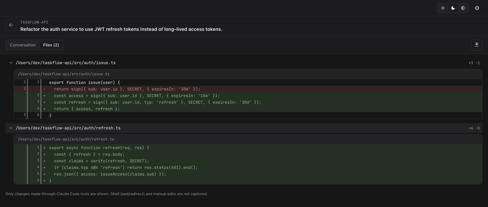
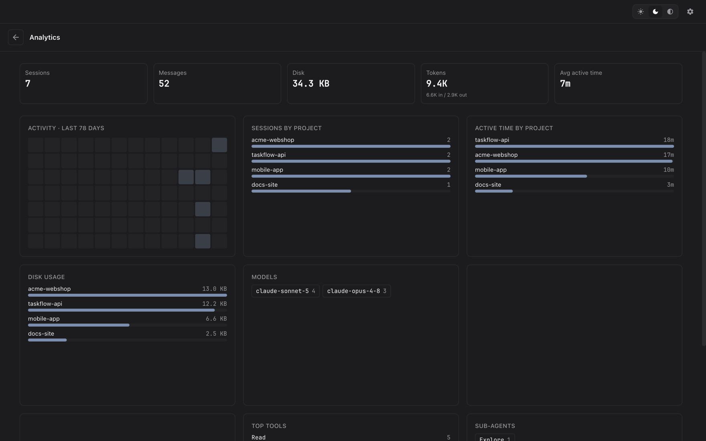

<!--
  Source of truth for the PUBLIC repo (nortmas/sessary) README.
  Lives in the private source repo under landing/ and is published to the public
  repo by .github/workflows/deploy-landing.yml, alongside the landing page.
  Image paths (assets/*) resolve against the public repo root after deploy.
-->

<div align="center">



# Sessary

**Your Claude Code sessions, out of the terminal and into view.**

[](https://github.com/nortmas/sessary/releases/latest)
[](https://github.com/nortmas/sessary/releases)


[**Website**](https://nortmas.github.io/sessary/) · [**Download for macOS**](https://github.com/nortmas/sessary/releases/latest/download/Sessary.dmg) · [**Releases**](https://github.com/nortmas/sessary/releases/latest)

</div>

<br />

<div align="center">
  
</div>

<br />

Sessary is a native macOS app that turns the session logs Claude Code writes to
`~/.claude/projects` into a fast, searchable library. Every conversation, tool call, diff,
and token is browsable, starrable, and taggable — no matter how you run Claude Code, and it
all stays on your Mac.

## Features

- **Browse & search** — every session across every project in one list. Full-text search, filter by project, and star or tag the ones worth keeping.
- **Full conversation viewer** — thinking blocks, tool calls, code diffs, and sub-agent sidechains, rendered the way you'd actually read code.
- **Usage analytics** — sessions, messages, tokens, active time, models, skills, and per-project breakdowns. See where your Claude Code time goes.
- **Changed files** — exactly which files a session touched, with before/after diffs reconstructed straight from the log.
- **Resume in terminal** — pick up any past session in your terminal of choice; the resume command is one click away.
- **Export & clean up** — save a conversation as self-contained HTML, or delete old sessions to reclaim disk — safely.

## Screenshots

|  |  |
|---|---|
|  |  |
| **Conversation viewer** — thinking, tool calls & sub-agents | **Changed files** — before/after diffs from the log |

<div align="center">
  
  <br />
  <em>Analytics — tokens, active time, models, tools and per-project breakdowns</em>
</div>

## Download

Get the latest build from **[Releases](https://github.com/nortmas/sessary/releases/latest)**:

**→ [Download Sessary.dmg](https://github.com/nortmas/sessary/releases/latest/download/Sessary.dmg)**

Then drag **Sessary** into your Applications folder.

### First launch

The build is currently **unsigned**, so on first launch macOS may report the app as
"damaged" or from an "unidentified developer". To open it once:

```sh
xattr -cr /Applications/Sessary.app
```

…then open it normally — **or** right-click the app in Finder → **Open**.

## Privacy — offline by design

Sessary reads your session files locally and renders them locally. **No account, no cloud
sync, no upload.** Your prompts, code, and file paths never leave your machine — the only
network calls are an optional update check and opt-out anonymous usage stats (two event
names, no content).

## Requirements

- macOS 10.12 or later
- Claude Code sessions on disk (Sessary reads `~/.claude/projects`)

---

<div align="center">
  <sub>Sessary — a session manager for Claude Code · <a href="https://nortmas.github.io/sessary/">nortmas.github.io/sessary</a></sub>
</div>
